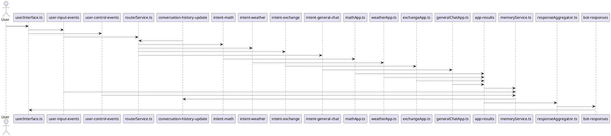

# Kafka Microservices Chatbot

This project refactors the class chatbot into a Kafka-based microservices architecture using Bun.

## Services and Topics

| Service | Consumes | Produces |
| --- | --- | --- |
| `userInterface.ts` | `bot-responses` | `user-input-events`, `user-control-events` |
| `memoryService.ts` | `user-input-events`, `app-results`, `user-control-events` | `conversation-history-update` |
| `routerService.ts` | `user-input-events`, `conversation-history-update` | `intent-math`, `intent-weather`, `intent-exchange`, `intent-general-chat` |
| `mathApp.ts` | `intent-math` | `app-results` |
| `weatherApp.ts` | `intent-weather` | `app-results` |
| `exchangeApp.ts` | `intent-exchange` | `app-results` |
| `generalChatApp.ts` | `intent-general-chat` | `app-results` |
| `responseAggregator.ts` | `app-results` | `bot-responses` |

Kafka topics (exact names):
- `user-input-events`
- `app-results`
- `bot-responses`
- `user-control-events`
- `intent-math`
- `intent-weather`
- `intent-exchange`
- `intent-general-chat`
- `conversation-history-update`
- `conversation-history-request`

## Architecture (PlantUML)



## Running Locally

1) Start Kafka + MySQL:

```
docker compose up -d
```

2) Install dependencies:

```
bun install
```

3) Run each service in its own terminal:

```
bun userInterface.ts
bun memoryService.ts
bun routerService.ts
bun mathApp.ts
bun weatherApp.ts
bun exchangeApp.ts
bun generalChatApp.ts
bun responseAggregator.ts
```

## Environment Variables

- `OPENAI_API_KEY` for `generalChatApp.ts`
- `OPENWEATHER_API_KEY` for `weatherApp.ts`
