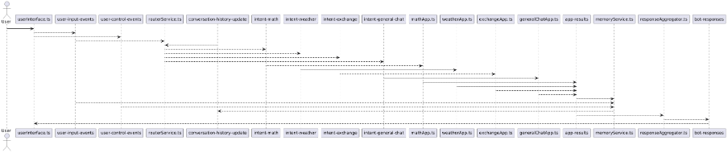

# Advanced Final Project — Event-Sourced Tool-Orchestrating Agent

## Architecture Diagram



## Overview
This project implements an event-sourced, CQRS-style tool-orchestrating agent over Kafka. Commands are produced into `user-commands` and `tool-invocation-requests`. Events are appended into `conversation-events`, which acts as the source of truth. Read models (history) are projections built from the event log.

## Event Sourcing + Stateful Stream Processing
- **Event Store**: `conversation-events` is the canonical log for reconstructing agent state and auditability.
- **CQRS**: commands and events are separated; projections are built from events only.
- **Stateful Orchestrator**: maintains plan state in LevelDB and recovers after restart.
- **Idempotent Workers**: tool workers de-duplicate `invocationId` to avoid double effects.
- **Schema validation + DLQ**: all producers/consumers validate against JSON schemas and send invalid messages to `dead-letter-queue`.

## Kafka Topics
- `user-commands`
- `conversation-events`
- `tool-invocation-requests`
- `synthesis-requests`
- `dead-letter-queue`

## Services
- **Web UI / Gateway**: uses the existing UI identifier flow. Produces `UserQueryReceived` commands and waits for `FinalAnswerSynthesized` events.
- **Router**: generates orchestration plans (Ollama Llama3 primary, OpenAI GPT‑3.5 fallback).
- **Orchestrator**: stateful plan processor; emits tool invocation commands and events.
- **Tool Workers**: math, exchange, weather, RAG retrieval (Python), LLM inference (Node), synthesis (Node).
- **Aggregator**: gathers results and requests synthesis.
- **History Projection**: builds `history.json` from events.
- **Metrics**: computes end‑to‑end latency, per‑tool latency, throughput, and best‑effort consumer lag.

## Run Instructions
1. Set environment variables:
```
OPENAI_API_KEY=...
WEATHER_API_KEY=...
```
2. Start stack:
```
docker compose up -d
```
3. (Optional) run services locally for development:
```
bun run services
bun --cwd packages/server run dev
bun --cwd packages/client run dev
```

## Benchmarking
See `BENCHMARK.md` for a detailed table. Key metrics captured by the metrics service:
- End‑to‑End Latency (UserQueryReceived → FinalAnswerSynthesized)
- Latency per Tool (ToolInvocationRequested → ToolInvocationResulted)
- Throughput (events/sec)
- Consumer Lag (best‑effort)

## Resilience Demos
- **Worker crash**: stop `rag-retriever-worker` mid‑plan; restart and resume.
- **Orchestrator crash**: stop orchestrator mid‑plan; restart and resume from LevelDB + event replay.
- **Duplicate events**: resend `ToolInvocationRequested`; workers ignore duplicate invocation IDs.

## Expanded Conclusions
**Why Kafka as Event Store**
- Provides durable, append‑only log for full auditability and replay.
- Enables recovery and debugging by reprocessing events.
- Supports independent scaling of command and event consumers.

**Stateful Processing**
- Orchestrator and aggregator track multi‑step progress over time.
- LevelDB state store prevents lost progress across crashes.

**CQRS + Idempotency Benefits**
- Clear separation of write path (commands) and read path (projections).
- Idempotent tool workers prevent double processing under retries and duplicates.

**Trade‑offs**
- Added operational complexity (multiple services + Kafka).
- Eventual consistency and harder debugging for distributed flows.

**Future Improvements**
- Kafka Streams DSL for robust stateful processing.
- Confluent Schema Registry and KSQL.
- Observability via Prometheus/Grafana.
