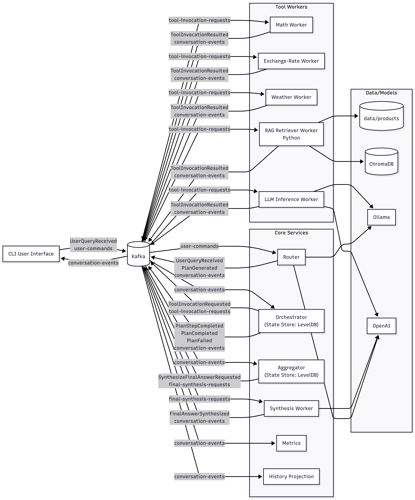

# Advanced Final Project — Event-Sourced Tool-Orchestrating Agent

## Architecture Diagram



## Overview

This project implements an event-sourced, CQRS-style orchestration system over Kafka.

- Commands are written to `user-commands`, `tool-invocation-requests`, and `final-synthesis-requests`.
- Domain events are appended to `conversation-events`, which is the system of record.
- Read models such as history and aggregation state are projections rebuilt from the event log.

## Kafka as Event Store

`conversation-events` is the canonical immutable log for conversation state.

- `UserQueryReceived` records user intent as an event.
- `PlanGenerated` records the router-produced orchestration plan.
- `ToolInvocationRequested`, `ToolInvocationResulted`, and `PlanStepCompleted` record execution progress.
- `PlanCompleted` and `PlanFailed` record terminal orchestration outcomes.
- `FinalAnswerSynthesisRequested` and `FinalAnswerSynthesized` record final-answer generation progress.

The orchestrator and aggregator both rebuild projection state from `conversation-events` on startup before subscribing to live traffic.

## Event Sourcing

The core runtime follows the event sourcing principle:

- state transitions are represented as immutable events in Kafka
- local LevelDB stores are projection caches, not the source of truth
- recovery is replay-backed rather than memory-backed

Examples:

- Orchestrator state is reconstructed from `PlanGenerated`, `ToolInvocationResulted`, `PlanCompleted`, and `PlanFailed`.
- Aggregator state is reconstructed from `UserQueryReceived`, `ToolInvocationResulted`, and `FinalAnswerSynthesisRequested`.
- Conversation history is reconstructed from `UserQueryReceived`, `FinalAnswerSynthesized`, and `UserHistoryReset`.

## CQRS

The project separates write-side commands from read-side events and projections.

- Commands request work on command topics and use a `commandType` envelope:
  `UserQueryReceived`, `ToolInvocationRequested`, `SynthesizeFinalAnswerRequested`
- Events record facts on `conversation-events` and use an `eventType` envelope:
  `UserQueryReceived`, `PlanGenerated`, `ToolInvocationRequested`, `ToolInvocationResulted`, `PlanCompleted`, `FinalAnswerSynthesized`
- Projections are built from events only and are never treated as authoritative state

Some semantic names intentionally appear on both sides, for example
`UserQueryReceived` as an incoming command and then as the persisted event that
records the accepted fact. The distinction is the topic plus the envelope
(`commandType` vs `eventType`), not just the label.

This keeps write flows auditable and read models disposable and replayable.

## Idempotency

Workers are duplicate-safe.

- Node workers use LevelDB-backed idempotency stores keyed by `invocationId`
- the Python RAG worker uses a SQLite idempotency store keyed by `invocationId`
- synthesis is deduplicated by `conversationId`

Duplicate command delivery therefore does not create duplicate `ToolInvocationResulted` or `FinalAnswerSynthesized` events.

## Kafka Topics

- `user-commands`
- `conversation-events`
- `tool-invocation-requests`
- `final-synthesis-requests`
- `dead-letter-queue`
- `schema-registry`

## Services

- `user-interface`: CLI producer/consumer for the rubric flow
- `router`: LLM-backed planning microservice
- `orchestrator`: stateful replay-backed plan executor
- `math-worker`
- `exchange-rate-worker`
- `weather-worker`
- `llm-inference-worker`
- `rag-retriever-worker`
- `aggregator`
- `synthesis-worker`
- `history-projection`
- `metrics`
- `web-gateway` and `client`: optional browser UI on top of the same Kafka pipeline

## Folder Structure

- `src/node`: Kafka services, shared libraries, and CLI
- `src/python`: RAG retrieval and indexing workers
- `src/schemas`: JSON schemas for commands and events
- `scripts`: indexing and resilience drill scripts
- `data/products`: RAG source documents
- `packages/server` and `packages/client`: optional web gateway and UI

## Run Instructions

1. Set environment variables:

```bash
OPENAI_API_KEY=...
WEATHER_API_KEY=...
```

2. Start the full stack:

```bash
docker compose up -d
```

3. Pull the Ollama model once:

```bash
docker compose exec ollama ollama pull llama3
```

4. Verify services:

```bash
docker compose ps
curl http://localhost:3000/api/kafka/health
```

5. Open the browser UI:

```text
http://localhost:5137
```

6. Or run the CLI:

```bash
docker compose run --rm --no-deps user-interface
```

### Standalone indexing

```bash
python scripts/index_products.py
```

## Resilience Evidence

The repository contains both documented drills and committed evidence artifacts.

- `EXECUTION_LOG.md`: full-stack orchestration, RAG, worker recovery, and duplicate-handling log
- `RESILIENCE_LOG.txt`: deterministic local resilience evidence generated from `scripts/generate_resilience_log.ts`
- `scripts/resilience_drill.ts`: Docker/Kafka drill for live local execution when Docker access is available
- `RESILIENCE.md`: grading-oriented resilience procedures and evidence mapping

Generate the deterministic local resilience log with:

```bash
bun scripts/generate_resilience_log.ts > RESILIENCE_LOG.txt
```

## Benchmarking

See `BENCHMARK.md` for the benchmark table. The metrics service logs:

- end-to-end latency from `UserQueryReceived` to `FinalAnswerSynthesized`
- per-tool latency from `ToolInvocationRequested` to `ToolInvocationResulted`
- throughput in events/sec
- best-effort consumer lag

## Trade-offs

- Event sourcing increases architectural complexity and makes debugging more stream-oriented.
- Replay-backed recovery depends on retained Kafka history and well-defined schemas.
- CQRS introduces eventual consistency between command handling and read models.
- Idempotency storage adds operational state, but it makes retries and crash recovery safe.

These trade-offs were chosen deliberately for auditability, replayability, and fault tolerance.

## Future Improvements

- add a production schema registry with compatibility enforcement
- export metrics to Prometheus/Grafana
- add distributed tracing across services
- add retention/compaction policies tuned per topic
- extend resilience drills into automated CI checks
